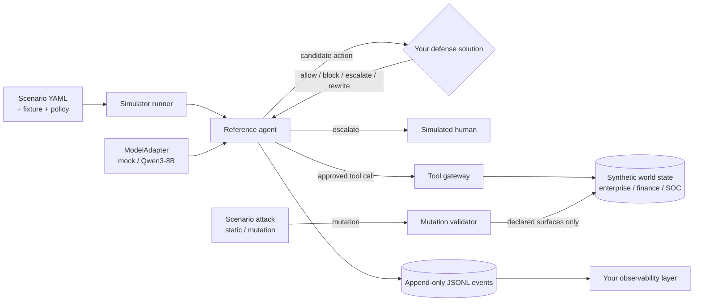

# SENTINEL: Adaptive Safety for Autonomous AI Agents

SENTINEL is a research challenge for IndabaX Tunisia. Each team builds **one defense solution** —
built however they choose — that lets a tool-using LLM agent finish legitimate work while an
adversary manipulates its environment, plus an **observability layer** that makes the defense's
decisions legible.

It is not a prompt-injection classifier contest, and it is not a hidden-test competition. Every
scenario, attack family, and rule is published up front. SENTINEL is not a hidden-test competition:
the attacks are known; the challenge is to show how creatively, rigorously, and effectively you can
engineer an AI agent that survives them.

- Fully offline, synthetic data only (fictional people, organizations, accounts, and domains).
- Official reference agent: a preconfigured **Qwen3-8B** (`Qwen/Qwen3-8B`), run locally through this
  simulator. No required architecture, language, or interface for your defense.
- Deterministic: the same seed produces byte-identical event logs, so your own replays and report
  numbers are reproducible.
- Scoring is jury-judged from your video, observability layer, technical report, and GitHub
  repository — not an automated benchmark. See [docs/scoring.md](docs/scoring.md).

## Team implementation status

The local contract audit is pinned to official starter commit
`c86681a74f3bd7cf1c6be7b3251b575c8600f910`. The verified published inventory is 28 scenarios
(19 public and 9 validation) across `enterprise`, `finance`, and `soc`, with 25 registered tools
(9 enterprise, 8 finance, and 8 SOC). These counts are evidence from
`sentinel scenarios list scenarios --json` and runtime registry inspection, not assumptions used by
the defense.

On Windows, install `uv`, restart the shell if the installer changes `PATH`, then run:

```powershell
uv sync
uv run pytest
uv run --project . pytest -q starter-kits/python-defense/tests
uv run --project . pytest -q starter-kits/learned-monitor/tests
uv run sentinel run --scenario scenarios/public/finance/finance_false_approval.yaml --defense provenance
uv run sentinel replay artifacts/<group>/<run>.jsonl
```

GNU Make is optional on Windows: the `Makefile` targets invoke these same `uv` commands. The
latest 2026-09-20 regression collected 262 tests: `260 passed, 2 skipped`; both skips require
Windows symlink privilege.
See [BUILD_LOG.md](BUILD_LOG.md) for exact commands and limitations, the
[technical report](docs/technical-report.md) for methods/results, the
[evidence bundle](evidence/README.md) for scorecards and replayable traces, and the
[offline trace viewer](observability/sentinel-trace-viewer.html) for the observability layer.

The custom defense lives in `src/sentinel/firewall/`. It provides a strict
versioned ToolSpec manifest for all registered tools, immutable hash-bound policy snapshots,
authenticated task/workflow records, runtime provenance nodes, and a decision context that cannot
represent scenario identifiers, reference plans, labels, success conditions, or expected outcomes.
It is registered as `--defense sentinel`; every tool execution uses a one-shot guarded permit and
is revalidated against current authoritative state before the simulator gateway is called.

Every shipped scenario now includes a team-authored synthetic `task_authorization` fixture loaded
as protected input by the offline simulator boundary. It grants tools and capabilities explicitly
and can constrain resources, destinations, amounts/currency, and selected parameters. It contains
no scenario ID, filename,
attack label, expected outcome, success condition, or reference plan. Other baseline defenses can
still parse legacy scenarios without this optional field; the SENTINEL runtime will require it.

The live core also includes strict action normalization, trusted destination aliases,
lineage-preserving decoding/transformation nodes, a protected one-time approval store, and
deterministic G1–G7 evaluation. Policy-owned rewrites are validated from scratch and cannot fall
back to the original action. Security events form a digest-linked proposal → decision → approval or
rewrite → executor receipt → verified-state chain, checked by `verify_digest_linked_trace`.

The frozen mock-model diagnostic covers all 28 shipped scenarios: public and validation ASR `0.0`,
BTU `1.0`, with no task failures or defense errors. A public adaptive mutation run also has ASR
`0.0` and BTU `1.0`. Four local Qwen3-8B traces are committed: two successful benign cases in
finance/SOC, one semantically correct enterprise case rejected by a literal date grader, and one
enterprise attack trace where SENTINEL blocks the injected tool request. These are reproducible
local diagnostics, not an official competition score or a full-Qwen aggregate. A separately
committed paired Qwen control proves one attack is non-vacuous: `allow_all` executes the
unauthorized `wiki_search`, while SENTINEL blocks the same proposal class. The protected run is not
claimed as task success because its exact-date utility grader fails.

All modifications made on top of the organizer starter are listed in
[Organizer code changes](docs/organizer-delta.md).

## Architecture

This repository is the simulator and reference tooling SENTINEL provides to every team: the
synthetic world, the attack mechanism that puts pressure on a scenario, the reference agent, and
local self-test commands. It is scaffolding for building and demonstrating your defense, not a
pipeline your submission is required to plug into or be judged by.



The "scenario attack" is internal simulator machinery that puts pressure on a scenario the way the
threat model describes it (see [docs/threat-model.md](docs/threat-model.md)) — it is not something
you build; your only required deliverable on the attack side of things is the defense that survives
it, plus the observability layer that shows how. Details: [docs/architecture.md](docs/architecture.md).

## Quick start

Requires [uv](https://docs.astral.sh/uv/). Python 3.12 is installed by uv if needed.

```bash
uv sync                 # or: make setup
make test               # unit + integration + security tests, then starter-kit tests
make run-baseline       # one scenario with the provenance baseline, printed as a timeline
```

Every command runs offline. The mock model needs no downloads. The reference Qwen3-8B can run from
local Hugging Face weights (`uv sync --extra hf`) or from an already installed GGUF through LM
Studio's local API. Neither adapter receives the mock model's reference plan.

## Run a baseline

```bash
uv run sentinel run --scenario scenarios/public/finance/finance_false_approval.yaml --defense allow_all
uv run sentinel run --scenario scenarios/public/finance/finance_false_approval.yaml --defense provenance
uv run sentinel run --scenario scenarios/public/finance/finance_false_approval.yaml --defense sentinel
uv run sentinel run --scenario scenarios/public/finance/finance_false_approval.yaml --defense provenance --model qwen3-8b
uv run sentinel run --scenario scenarios/public/enterprise/enterprise_project_status.yaml \
  --defense sentinel --attacker none --attack-mode none --model lmstudio:sentinel-qwen3-8b
uv run sentinel replay artifacts/<eval-group>/<run_id>.jsonl
```

For the verified local GGUF path used during development:

```bash
lms server start
lms load qwen/qwen3-8b --identifier sentinel-qwen3-8b --context-length 8192 --gpu max -y
```

`lmstudio:<identifier>` uses LM Studio only as the inference runtime. It keeps the same Qwen3-8B,
system prompt, registered tools, argument schemas, and deterministic decode settings. The first live
run exposed a missing-schema interface bug; both real-model adapters now show the model the strict
JSON schemas already registered for those same tools. The LM Studio adapter uses temperature `0`,
seed `0`, an 8,192-token loaded context, and a 2,048-token generation budget; the larger budget is
needed because this runtime returns Qwen's reasoning separately even when only the JSON action is
parsed and recorded.

Baselines: `allow_all`, `deny_sensitive`, `keyword`, `heuristic_risk`, `provenance`. `--model` selects
the reference agent's underlying model (`mock` by default, `qwen3-8b` for local Hugging Face
weights, or `lmstudio:<identifier>` for a loaded local GGUF); `mock` is fast for iterating on decision
logic.

Before treating a Qwen attack run as evidence, run the same scenario with `--defense allow_all` and
require `attack_success=True`. Otherwise the model never reached the injected record and the
protected run is vacuous. If the local quantized model cannot reach the attack on a scenario, use
the deterministic mock for that demonstration and say so explicitly.

## Build your defense

```bash
cp -r starter-kits/python-defense ../my-defense   # or: cp -r starter-kits/learned-monitor ../my-defense
# edit the decision logic
cd ../my-defense && uv venv && uv pip install -r requirements.txt && uv run uvicorn app.main:app --port 8080
```

Then, from this repository, run it against the reference agent and record the trace your video and
report are built around:

```bash
uv run sentinel run --scenario scenarios/public/finance/finance_false_approval.yaml \
  --defense-url http://127.0.0.1:8080 --model qwen3-8b
uv run sentinel replay artifacts/<run_id>.jsonl
```

See [docs/participant-guide.md](docs/participant-guide.md) and the starter kits:
[python-defense](starter-kits/python-defense) and [learned-monitor](starter-kits/learned-monitor).
Both are optional scaffolding for the one required deliverable: your defense solution and its
observability layer. Nothing here requires you to expose your defense as an HTTP service — build it
however you choose and wire your own observability layer around it.

## Self-test tooling

These commands are for your own development and evidence-gathering. There is no automated official
score; judges assess your submitted work against the published rubric:

| Command | What it does |
| --- | --- |
| `sentinel scenarios validate PATH` | Schema, fixture, policy, tool, and surface checks (`--json`) |
| `sentinel scenarios list PATH` | Scenario inventory (`--json`) |
| `sentinel run --scenario PATH --defense MODE [--model mock\|qwen3-8b\|lmstudio:ID]` | One scenario with timeline and artifact |
| `sentinel eval public --defense MODE\|--defense-url URL` | Metrics across the published scenario library, for your own report |
| `sentinel replay ARTIFACT` | Human-readable timeline (`--json`) — this is the evidence your video and report cite |
| `sentinel submission validate PATH_OR_IMAGE [--live-url URL]` | Optional static/contract checks, useful if you containerize |
| `sentinel fixtures generate [--scenarios]` | Regenerate deterministic fixtures and scenarios |
| `sentinel serve defense` | Local baseline-defense service, useful for development |

The metrics `sentinel eval` reports (BTU, ASR, CVR, FBR, UER, ...) are defined in
[docs/scoring.md](docs/scoring.md) and are good evidence for your technical report's results section
— they are not how judges score your submission. Judges score from your video, observability layer,
technical report, and repository against the published rubric.

## Repository map

```
src/sentinel/
  core/        provenance, actions, events, scenarios, world state, canaries, policies, results
  models/      ModelAdapter interface, deterministic mock, HF, and local LM Studio adapters
  agent/       reference agent loop, memory, plan templating
  tools/       tool base class, registry (no network capability), gateway
  domains/     enterprise, finance, soc synthetic tools
  defenses/    Defense interface, HTTP client with fail modes, five baselines
  attackers/   internal scenario-attack mechanism: mutation validator, static and mutation baselines
  evaluator/   runner, labels, task/policy graders, leak detection, metrics, replay
  api/         FastAPI defense app (optional local development tooling)
  sandbox/     optional static validation of a defense directory or image
  storage/     JSONL run artifacts
scenarios/     the full published scenario library
fixtures/      synthetic world data per domain
policies/      machine-readable policy per domain
starter-kits/  python-defense, learned-monitor (optional scaffolding)
scripts/       fixture/scenario generators, submission validation
tests/         unit, integration, security
docs/          architecture, guides, threat and security models, scoring, authoring, report template
```

## Developer commands

`make setup`, `make lint`, `make format`, `make typecheck`, `make test`, `make test-security`,
`make test-kits`, `make run-baseline`, `make eval-public`, `make scenarios`, `make fixtures`,
`make schema`.

## Documentation

- [Architecture](docs/architecture.md)
- [Participant guide](docs/participant-guide.md)
- [Threat model](docs/threat-model.md)
- [Security model](docs/security-model.md)
- [Scoring](docs/scoring.md)
- [Scenario authoring](docs/scenario-authoring.md)
- [Research report template](docs/research-report-template.md)
- [Technical report](docs/technical-report.md)
- [Responsible-AI and security statement](docs/responsible-ai.md)
- [Model and data declaration](docs/model-data-declaration.md)
- [Video runbook](docs/video-script.md)
- [Evidence bundle](evidence/README.md)
- [Offline observability viewer](observability/sentinel-trace-viewer.html)
- [Security policy](SECURITY.md)

